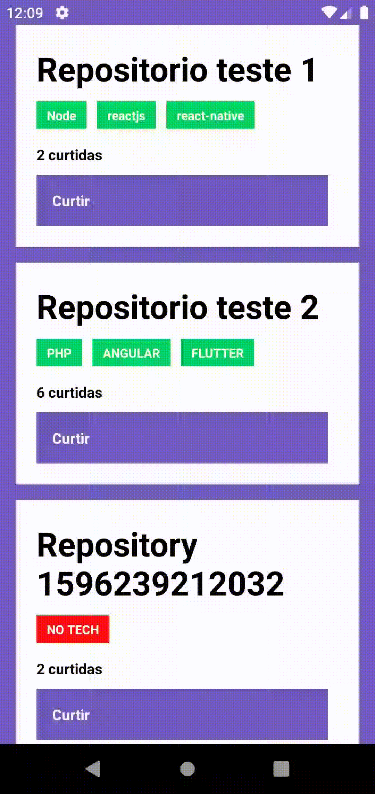
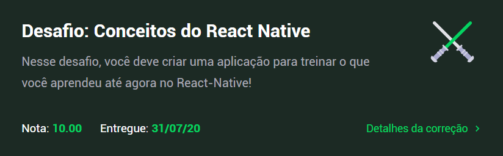

<h1 align="center">
  GoStack 11 - Rocketseat
</h1>

<h3 align="center">
  Desafio 04: Conceitos do React-Native
</h3>

<blockquote align="center">“Lembre-se que as pessoas podem tirar tudo de você, menos o seu conhecimento. - Albert Einstein”!</blockquote>

<p align="center">
  

  <a href="https://www.linkedin.com/in/cleytonalves">
    
  </a>

  

  <a href="https://github.com/cleyton1986/rocketseat-gostackdesafio04-conceitos-react-native/stargazers">
    
  </a>
</p>

<p align="center">
  <a href="#tecnologias-e-recursos">Tecnologias e Recursos</a>&nbsp;&nbsp;&nbsp;|&nbsp;&nbsp;&nbsp;
  <a href="#sobre-o-desafio">Sobre o desafio</a>&nbsp;&nbsp;&nbsp;|&nbsp;&nbsp;&nbsp;
    <a href="#funcionalidades-da-aplicação">Funcionalidades da aplicação</a>&nbsp;&nbsp;&nbsp;|&nbsp;&nbsp;&nbsp;
  <a href="#específicação-dos-testes">Especificação de testes</a> &nbsp;&nbsp;&nbsp;|&nbsp;&nbsp;&nbsp;
  <a href="#instalação-e-execução">Instalação e execução</a> &nbsp;&nbsp;&nbsp;| &nbsp;&nbsp;&nbsp;
  <a href="#calendar-entrega">Entrega</a>&nbsp;&nbsp;&nbsp;| &nbsp;&nbsp;&nbsp;
  <a href="#memo-licença">Licença</a>
</p>

## Tecnologias e recursos

- [React-Native](https://github.com/facebook/react-native)
- [Axios](https://github.com/axios/axios)
- [Axios-mock-adapter](https://github.com/ctimmerm/axios-mock-adapter)
- [Node.js](https://nodejs.org/) (api do servidor)
- [JEST](https://github.com/facebook/jest)


## Sobre o desafio

Agora você deve continuar desenvolvendo a aplicação mobile que irá listar os repositórios que você já desenvolveu o backend utilizando o Node.js, e no último desafio em ReactJS.

<p align="center">
  
</p>

## Funcionalidades da aplicação

- **`Listar os repositórios da sua API`**: Deve ser capaz de criar uma lista de todos os repositórios que estão cadastrados na sua API com os campos **title**, **techs** e número de curtidas seguindo o padrão `${repository.likes} curtidas`, apenas alterando o número para ser dinâmico.

- **`Curtir um repositório listado da API`**: Deve ser capaz de curtir um item na sua API através de um botão com o texto **Curtir** e deve atualizar o número de likes na listagem no mobile.

## Específicação dos testes

Para esse desafio temos o seguinte teste:

- **`should add a like to the like counter of the repository`**: Para que esse teste passe, sua aplicação deve permitir ao clicar no botão `Curtir`, um like seja adicionado ao repositório listado, e que essa atualização possa ser visualizada na tela.


## :calendar: Entrega

Esse desafio foi entregue na plataforma Skylab - Rocketseat.

<p align="center">
  
</p>

## Instalação e execução

OBS: Antes de executar este projeto é preciso clonar e executar o projeto back-end em node.js através do link abaixo (entre e siga as intruções de "Instalação e execução"):
## [PROJETO NODE.JS](https://github.com/cleyton1986/rocketseat-gostack-desafio02-conceitos-nodejs)


**Atenção**: Caso você esteja emulando no iOS, na pasta do seu projeto navegue até a pasta ios executando o comando `cd ios` e depois execute `pod install` para instalar todas as dependências para o iOS.

```bash
# Clone esse repositório
$ git clone https://github.com/cleyton1986/rocketseat-gostackdesafio04-conceitos-react-native

# Entre no diretório
$ cd rocketseat-gostackdesafio04-conceitos-react-native

# Instale as dependências
$ yarn

# Rode a aplicação se você estiver usando o emulador do android
$ yarn android

# ou rode usando o comando abaixo se você estiver usando o emulador do iOS
$ yarn ios

# Rode os testes
$ yarn test
```


## :memo: Licença

Esse projeto está sob a licença MIT. Veja o arquivo [LICENSE](LICENSE) para mais detalhes.

---

 implementado por 👨🏽‍💻 Cleyton Alves e desenvolvido 💜 by Rocketseat.
